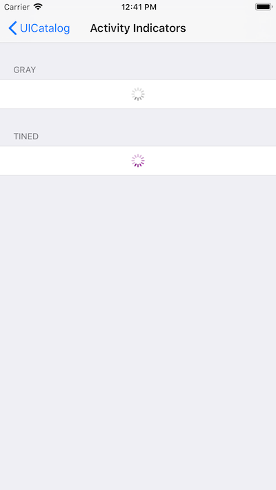

# UICatalog: Creating and Customizing UIKit Controls

This sample is a catalog exhibiting many views and controls in the `UIKit` framework along with their various functionalities. Refer to this sample if you are looking for specific controls or views that are provided by the system.

Note that this sample also shows you how to make your non-standard views (images or custom views) accessible. Using the iOS Accessibility API enhances the user experience of VoiceOver users.

You will also notice this sample shows how to localize string content by using the `NSLocalizedString` macro. Each language has a "Localizeable.strings" file and this macro refers to this file when loading the strings from the default bundle.

## Using the Sample

This sample can be run on a device or on the simulator.

While looking over the source code of UICatalog you will find that many elements keep the same order of the view controller classes listed in the project. For example, `AAPLActionSheetViewController` is the first view controller in the UICatalog project folder, but it is also the first view controller that's shown in the master view controller's table view.

UICatalog uses a master/detail application architecture, which can be seen in the storyboard files. The master view controller defines the list of views that are used for demonstration in this application. Each detail view controller corresponds to a given system-provided control (and is named accordingly). For example, `AAPLAlertViewController` shows how to use `UIAlertView` and its associated functionality. The only two exceptions to this rule are `UISearchBar` and `UIToolbar`; each of these controls have multiple view controllers to explain how the control works and can be customized. This is done to make sure that each view controller only has one `UIToolbar` or `UISearchBar` in a view controller at one point in time. Each view controller is responsible for configuring a set of of specific controls that have been set in Interface Builder.

## UIKit Controls

UICatalog demonstrates how to configure and customize the following controls:

* UIActionSheet
* UIActivityIndicatorView
* UIAlertView
* UIButton
* UIDatePicker
* UIImageView
* UIPageControl
* UIPickerView
* UIProgressView
* UISegmentedControl
* UISlider
* UIStepper
* UISwitch
* UITextField
* UITextView
* UIWebView
* UISearchBar
* UIToolbar

## Build Requirements

Xamarin.iOS 11.0+ and Xcode 9.0+.

## License

Xamarin port changes are released under the MIT license.
